# Week 5 Assignment: MySQL Database Operations

## Task 2: Create database and table in your MySQL server

**1. Create the `website` database:**
```sql
CREATE DATABASE website;
USE website;
```
**2. Create the `member` table:**
```sql
CREATE TABLE member (
    id BIGINT UNSIGNED AUTO_INCREMENT PRIMARY KEY,
    name VARCHAR(255) NOT NULL,
    email VARCHAR(255) NOT NULL,
    password VARCHAR(255) NOT NULL,
    follower_count INT UNSIGNED NOT NULL DEFAULT 0,
    time DATETIME NOT NULL DEFAULT CURRENT_TIMESTAMP
);
```
Execution Result:

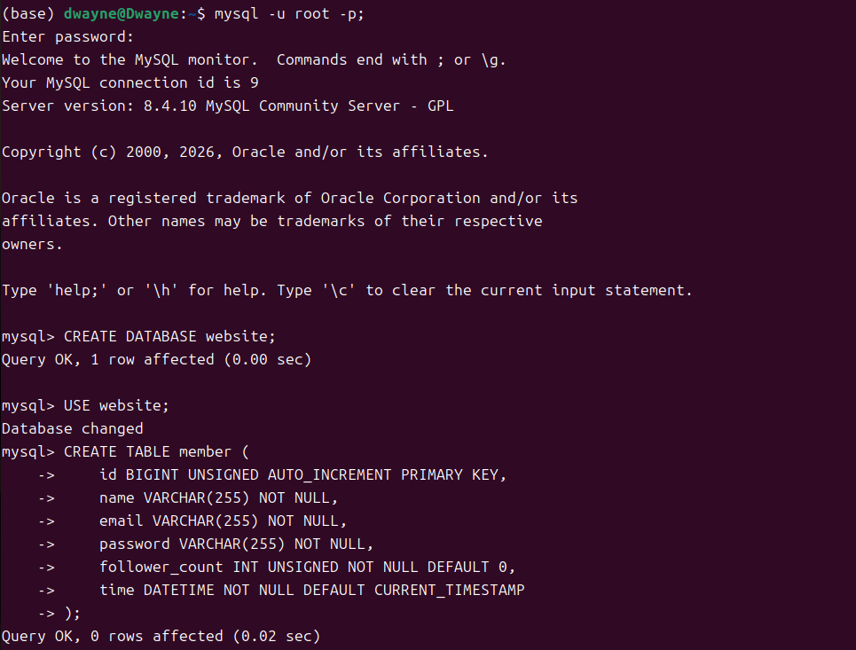

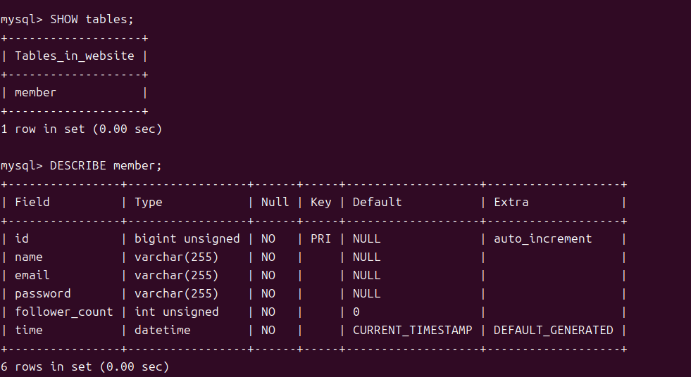

## Task 3: SQL CRUD
**1. INSERT a new row (test) and INSERT additional 4 rows with arbitrary data:**
```sql
INSERT INTO member (name, email, password) 
VALUES ('test', 'test@test.com', 'test');
```
```sql
INSERT INTO member (name, email, password) VALUES 
('alice', 'alice@example.com', '1234'),
('bob', 'bob@example.com', '5678'),
('jessica', 'jessica@example.com', 'abcd'),
('danny', 'danny@example.com', 'qwer');
```
Execution Result:


**2. SELECT all rows from the `member` table:**
```sql
SELECT * FROM member;
```
Execution Result:

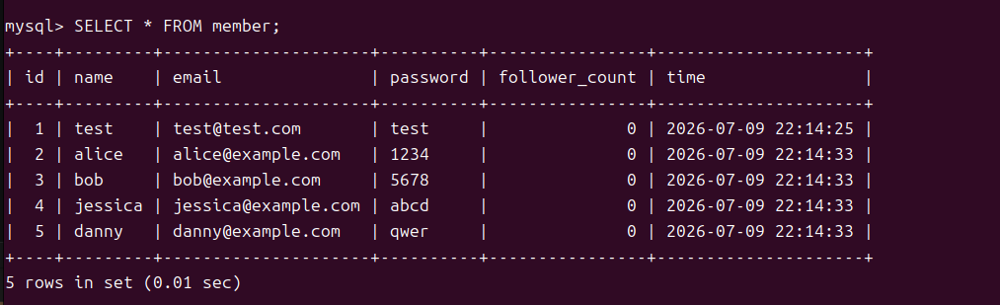

**3. SELECT all rows in descending order of time:**
```sql
SELECT * FROM member ORDER BY time DESC;
```
Execution Result:

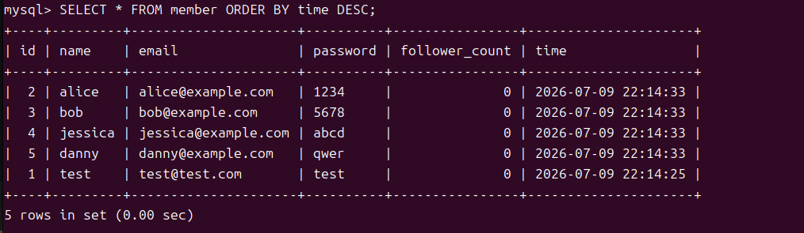

**4. SELECT total 3 rows, second to fourth, in descending order of time:**
```sql
SELECT * FROM member ORDER BY time DESC LIMIT 3 OFFSET 1;
```
Execution Result:

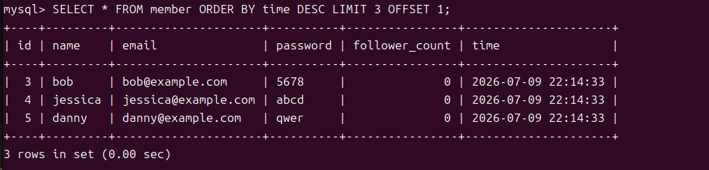

**5. SELECT rows where email equals to test@test.com:**
```sql
SELECT * FROM member WHERE email = "test@test.com";
```
Execution Result:


**6. SELECT rows where name includes the es keyword:**
```sql
SELECT * FROM member WHERE name LIKE "%es%";
```
Execution Result:

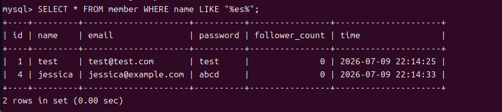

**7. SELECT rows where email equals to test@test.com and password equals to test:**
```sql
SELECT * FROM member WHERE email = 'test@test.com' AND password = 'test';
```
Execution Result:

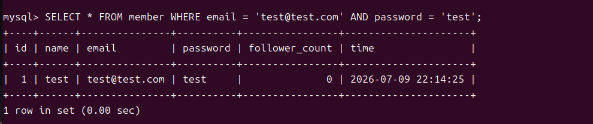

**8. UPDATE data in name column to​​ test2 ​​where email equals ​​to ​​test@test.com​​:**
```sql
UPDATE member SET name = "test2" WHERE email = "test@test.com";
```
Execution Result:

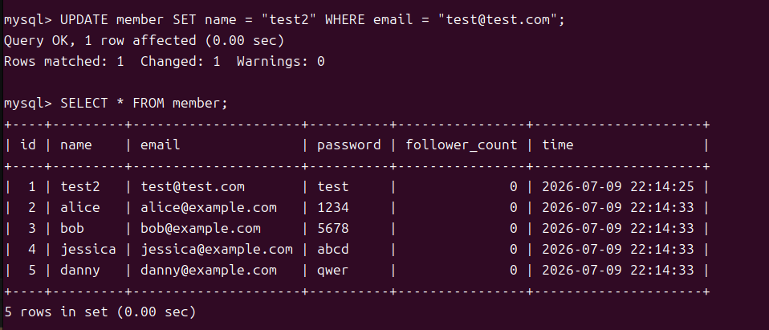

## Task 4: SQL Aggregation Functions
**1. SELECT how many rows from the `member` table:**
```sql
SELECT COUNT(*) FROM member;
```
Execution Result:


**2. SELECT the sum of follower_count:**
```sql
SELECT SUM(follower_count) FROM member;
```
Execution Result:

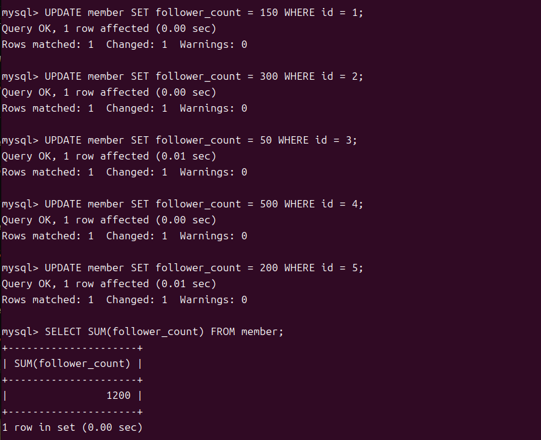

**3. SELECT the average of follower_count:**
```sql
SELECT AVG(follower_count) FROM member;
```
Execution Result:


**4. SELECT the average of follower_count of the first 2 rows (descending order):**
```sql
SELECT AVG(follower_count) 
FROM (SELECT follower_count FROM member ORDER BY follower_count
DESC LIMIT 2) AS top_two;
```
Execution Result:

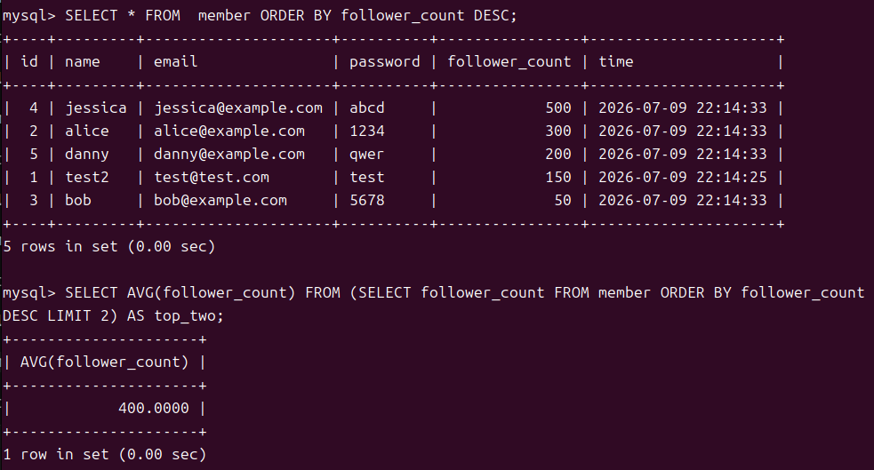

## Task 5: SQL JOIN

**1. Create the `message` table (with Foreign Key constraint):**
```sql
CREATE TABLE message (
    id BIGINT UNSIGNED AUTO_INCREMENT PRIMARY KEY,
    member_id BIGINT UNSIGNED NOT NULL,
    content TEXT NOT NULL,
    like_count INT UNSIGNED NOT NULL DEFAULT 0,
    time DATETIME NOT NULL DEFAULT CURRENT_TIMESTAMP,
    FOREIGN KEY (member_id) REFERENCES member(id)
);
```
Execution Result:

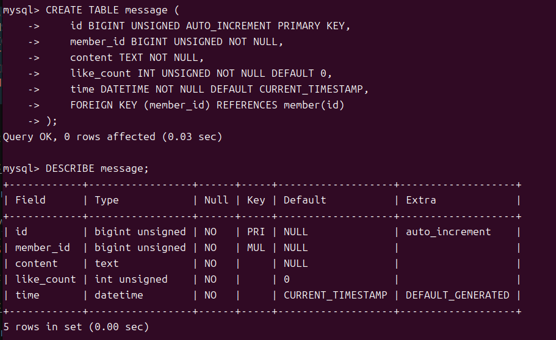

**2. SELECT all messages, including sender names:**
```sql
SELECT member.name, message.content, message.time 
FROM message 
INNER JOIN member ON member.id = message.member_id;
```
Execution Result:

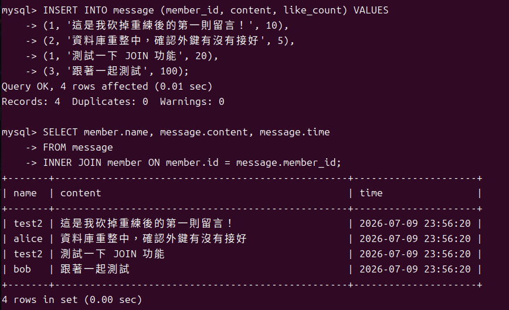

**3. SELECT all messages, including sender names, where sender email equals to​ test@test.com:**
```sql
SELECT member.name, message.content, message.time  
FROM message  
INNER JOIN member ON member.id = message.member_id 
WHERE member.email = "test@test.com";
```
Execution Result:

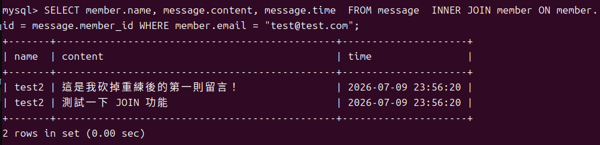


**4. SELECT average like count of messages where sender email equals to test@test.com:**
```sql
SELECT AVG(message.like_count) 
FROM message 
INNER JOIN member ON member.id = message.member_id 
WHERE member.email = 'test@test.com';
```
Execution Result:


**5. SELECT average like count of messages GROUP BY sender email:**
```sql
SELECT member.email, AVG(message.like_count) 
FROM message 
INNER JOIN member ON member.id = message.member_id 
GROUP BY member.email;
```
Execution Result:


## the end